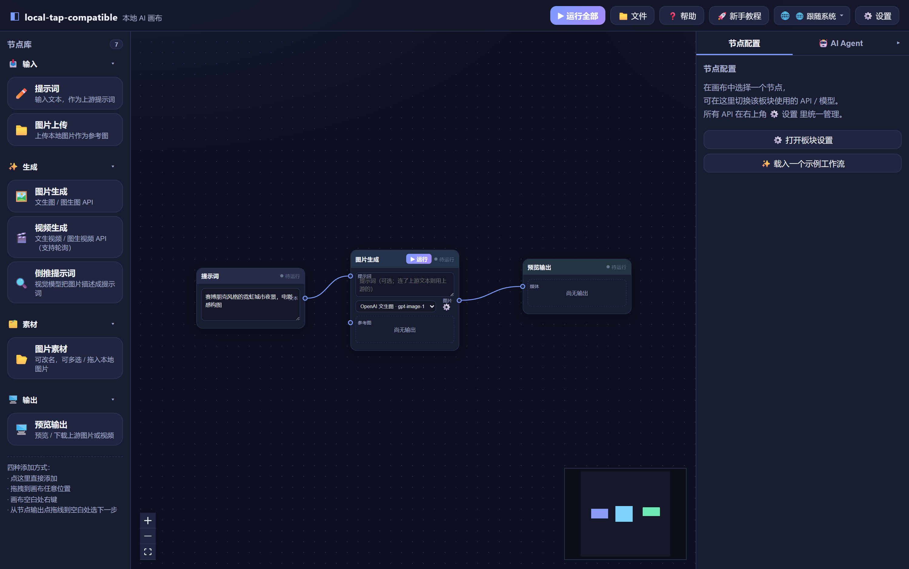
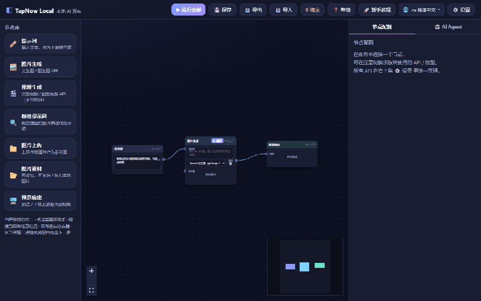
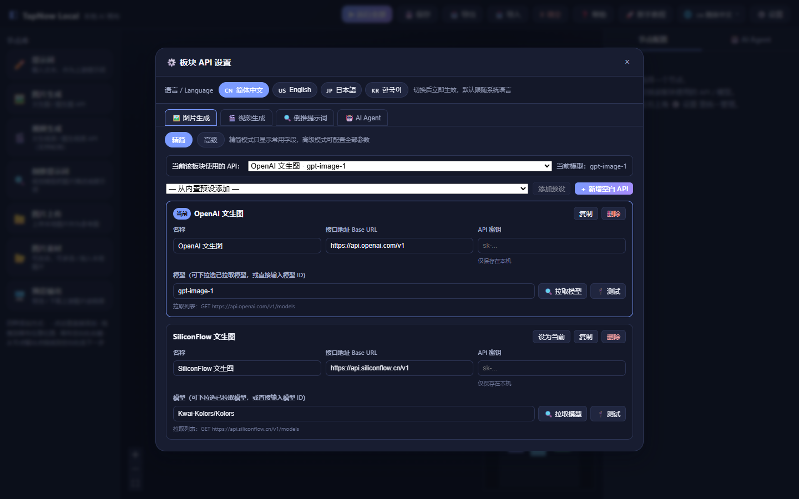

# local-tap-compatible — 本地 AI 无限画布

> [English](./README.en.md) | 简体中文


> 无限画布 + 节点式 AI 工作流，接入你自己的任意 API。图片、视频、倒推提示词，一条连线跑通。

[](https://github.com/jsxxwhai/localtapcompatible/stargazers)
[](./LICENSE)
[](https://github.com/jsxxwhai/localtapcompatible/actions)





## ✨ 为什么是 local-tap-compatible？

一个**完全本地**的无限画布式 AI 工作流：把「提示词 → 图片/视频生成 → 倒推提示词 → 预览输出」串成一条可视化的节点链路，所有 API 都用**你自己的 Key**，不上传任何云端。

| 能力 | 说明 |
| --- | --- |
| 🧩 节点式工作流 | 提示词、图片生成、视频生成、倒推提示词、图片上传、素材、预览输出 |
| 📥 内置示例 | 文生图 / 图生视频 / 倒推提示词 / 多参考图，文件菜单一键载入 |
| 🔌 任意 API | 兼容 AI Platform / SiliconFlow / 可灵 / Seedance / Runway 等任何 HTTP 接口 |
| 🖥️ 无限画布 | 缩放、平移、框选、拖拽连线，可视化交互 |
| 🌐 多语言 | 简体中文 / English / 日本語 / 한국어，默认跟随系统，顶部随时切换 |
| 🛡️ 隐私优先 | API Key 只存本地浏览器，零云端中转 |
| 💻 桌面版 | Windows 原生（WinForms + WebView2），单进程、关闭即退、不驻留 |



## 🚀 快速上手

```bash
npm install
npm run dev   # 前端 http://localhost:5173，后端 http://localhost:3001
```

1. 左侧节点库添加：**提示词 → 图片生成 → 预览输出**
2. 从节点输出口拖线到下一节点输入口
3. 点「图片生成」节点，右侧面板配置 API（Base URL、路径、模型、请求体）
4. 点节点上的 **▶ 运行**，或顶部 **运行全部**

## 🖥️ 桌面版

```bash
npm run desktop:build   # 输出 release/LocalTapCompatible.exe
```

**零后台驻留**：关闭窗口即完全退出。约 390MB 内存（含系统 WebView2 内核），磁盘仅约 5MB，比 Electron 方案更轻。

## ⌨️ 键盘快捷键

| 快捷键 | 功能 |
| --- | --- |
| Ctrl+S | 保存画布 |
| Ctrl+Enter | 运行全部 |
| Ctrl+D | 复制选中节点 |
| Ctrl+, | 打开设置 |
| Esc | 关闭帮助 / 教程 / 设置浮层 |

## 📖 详细文档

- **交互操作**：拖线连接、画布右键菜单、桌面式框选、面板拖拽、倒推提示词
- **API 配置**：每个板块可配多个 API，支持「拉取模型」「连通性测试」「异步任务轮询」
- **异步视频**：提交任务 → 轮询状态 → 取结果，全自动
- 完整说明见源码内联注释与各组件文件

## 🗺️ Roadmap

- [x] 多语言（zh/en/ja/ko）
- [x] 桌面版（Windows）
- [x] 简洁/高级设置模式
- [ ] macOS / Linux 桌面版
- [ ] 插件/自定义节点系统
- [ ] 工作流模板市场

## 🤝 贡献

欢迎提 Issue / PR。开发环境见上，提交前请运行 `npm run build`。

## 📄 License

[MIT](./LICENSE) © jsxxwhai
